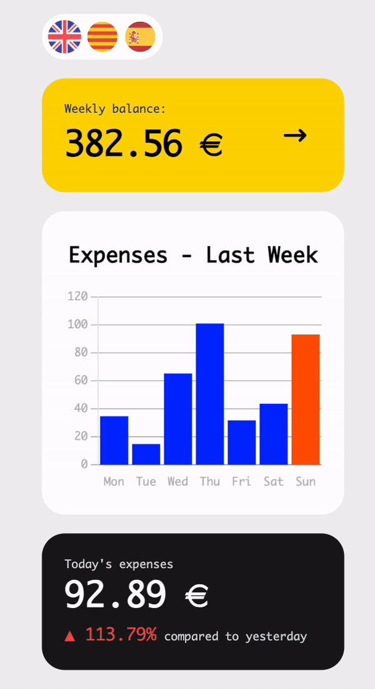
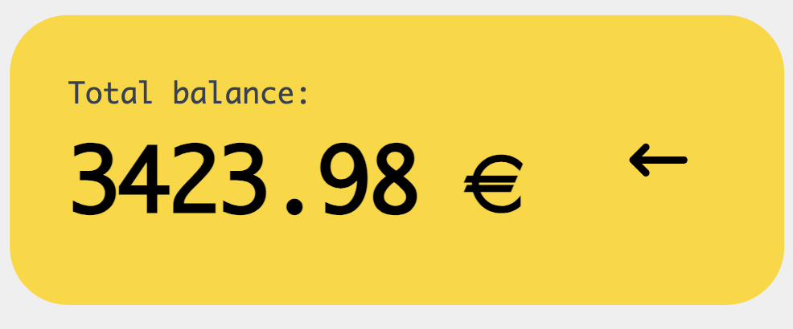
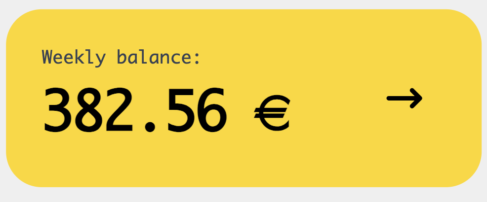
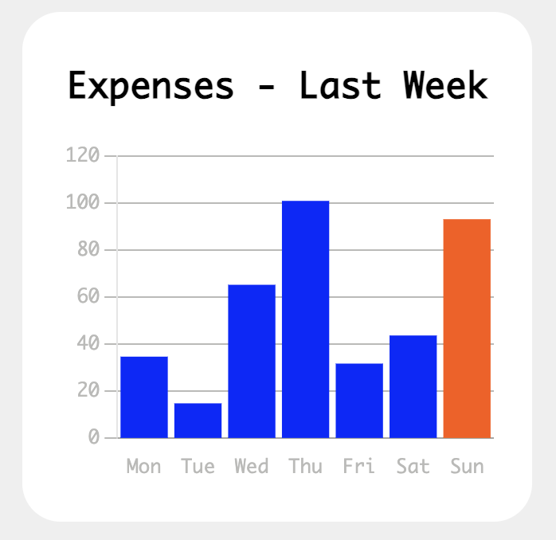
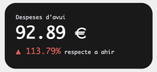
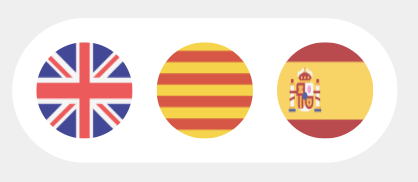

# React Incorpode

<div align="center"></div> 
<br>

This project involves creating a frontend application for managing and visualizing expenses. Using React and context, the app handles expense balance, today's expenses, percentage changes, and chart data. It integrates charts with Charts.js and supports multiple languages via the i18n library. Code quality is ensured with Vitest JSDOM tests and SonarCloud.

## Table of Contents

1. [Features](#features)
2. [Technologies](#technologies)
3. [Project file Structure](#project-file-structure)
4. [Installation](#installation)
5. [Screenshots](#screenshots)
6. [Contributing](#contributing)
7. [Author](#author)

## Features

- **Responsive Design:** Built with Tailwind CSS and Flowbite to ensure a sleek and responsive UI.
- **Modular Components:** Uses reusable React components for maintainability tries to aply SOLID bases.
- **State Management:** State is managed using Context for scalability.
- **Multi-language Support:** Integrated with i18n for localization.
- **Data Visualization:** Interactive charts and data representation using Charts.js.

## Technologies

**Frontend:**

<a href="https://reactjs.org/" style="text-decoration: none;">
    
</a>
<a href="https://developer.mozilla.org/en-US/docs/Web/JavaScript" style="text-decoration: none;">
    
</a>
<a href="https://tailwindcss.com/" style="text-decoration: none;">
    
</a>
<a href="https://flowbite.com/" style="text-decoration: none;">
    
</a>
<a href="https://www.w3.org/Style/CSS/Overview.en.html" style="text-decoration: none;">
    
</a>

**Tools and Libraries:**

<a href="https://vitejs.dev/" style="text-decoration: none;">
    
</a>
<a href="https://reactjs.org/docs/typechecking-with-proptypes.html" style="text-decoration: none;">
    
</a>
<a href="https://www.chartjs.org/" style="text-decoration: none;">
    
</a>
<a href="https://www.i18next.com/" style="text-decoration: none;">
    
</a>
<a href="https://vitest.dev/" style="text-decoration: none;">
    
</a>
<a href="https://sonarcloud.io/" style="text-decoration: none;">
    
</a>
<a href="https://postcss.org/" style="text-decoration: none;">
    
</a>
<a href="https://eslint.org/" style="text-decoration: none;">
    
</a>
<a href="https://prettier.io/" style="text-decoration: none;">
    
</a>

<br>

## Project file Structure

<details>

```bash
.REACT-INCORPODE
├── .github/workflows/sonarcloud.yml #SonarCloud GitHub config
├── node_modules #Dependencies
├── public
│   ├── demo
│   └── favicon.ico
├── src
│   ├── assets
│   │   ├── flags
│   │   ├── font
│   │   └── png
│   ├── components
│   │   ├── BalanceSheet
│   │   │   ├── BalanceSheet.jsx
│   │   │   └── BalanceSheet.test.jsx
│   │   ├── DailyExpenses
│   │   │   ├── DailyExpenses.jsx
│   │   │   └── DailyExpenses.test.jsx
│   │   ├── LanguageSelector
│   │   │   ├── LanguageSelector.jsx
│   │   │   └── LanguageSelector.test.jsx
│   │   └── WeeklyExpenseChart
│   │       ├── WeeklyExpenseChart.jsx
│   │       └── WeeklyExpensesChart.test.jsx
│   ├── config
│   │   └── i18n.js
│   ├── context
│   │   ├── SpendingContext.jsx
│   │   └── SpendingProvider.jsx
│   ├── hooks
│   │   ├── useChartOptions.jsx
│   │   └── useSpending.jsx
│   ├── App.jsx
│   ├── index.css
│   └── main.jsx
├──.gitignore
├── eslint.config.js
├── index.html
├── package-lock.json
├── package.json
├── postcss.config.cjs
├── README.md
├── setupTests.js
├── sonar-project.properties
├── tailwind.config.cjs
├── vite.config.js
└── vitest.config.js
```

</details>

## Installation

To get started with React-Incorpode, follow these steps:

1. Clone the repository:

   ```
   git clone https://github.com/Luovtyrell/React-Incorpode.git
   ```

2. Navigate to the project directory:

   ```
   cd React-Incorpode
   ```

3. Install the dependencies:

   ```
   npm install
   ```

4. Start the development server:
   ```
   npm run dev
   ```

## Screenshots

| Component                | Screenshot                                                                                                          | Description                                                                                                          |
| ------------------------ | ------------------------------------------------------------------------------------------------------------------- | -------------------------------------------------------------------------------------------------------------------- |
| **Balance Sheet**        |                 | Displays weekly or total expenses with a toggle button. Integrates with `useSpending` and `i18n.`                    |
| **Weekly Expense Chart** |                                                             | Renders a bar chart of weekly expenses using `react-chartjs-2` and `Chart.js`, with labels in the selected language. |
| **Daily Expenses**       |  | Shows today’s expenses and percentage change from yesterday. Updates color and symbol based on the change.           |
| **Language Selector**    |                                                                | Let users switch between languages using flags. Utilizes `i18n` for language changes.                                |

## Contributing

Welcome contributions to React-Incorpode! If you'd like to contribute, please follow these steps:

1. Fork the repository
2. Create a new branch (`git checkout -b feature/AmazingFeature`)
3. Make your changes
4. Commit your changes (`git commit -m 'Add some AmazingFeature'`)
5. Push to the branch (`git push origin feature/AmazingFeature`)
6. Open a Pull Request

## Author

[](https://github.com/Luovtyrell) <a href="https://www.github.com/Luovtyrell"> <br>

</a>

<a href="mailto:luciaorvilanova@gmail.com" target="_blank" rel="noreferrer"></a> <a href="https://www.linkedin.com/in/luovtyrell" target="_blank" rel="noreferrer"></a> <a href="https://t.me/luovtyrell" target="_blank" rel="noreferrer"></a> <a href="http://discordapp.com/users/664163194989707308" target="_blank" rel="noreferrer"></a>
